# Sales-Data-Analysis
## Problem Statement:-
Amaze is a hardware solutions company operating in multiple locations within India. The leadership team noticed a steep decline in overall revenue despite receiving positive sales reports from regional managers in different states. This led the management to hire a data analyst to find key insights from the data collected from the nationwide offices. As a part of this, the analyst is provided with a SQL sales database containing multiple tables related to the transactions, offices, product details, etc. The assigned task is to design an interactive dashboard containing region-wise and data-wise sales insights to make an effective decision.
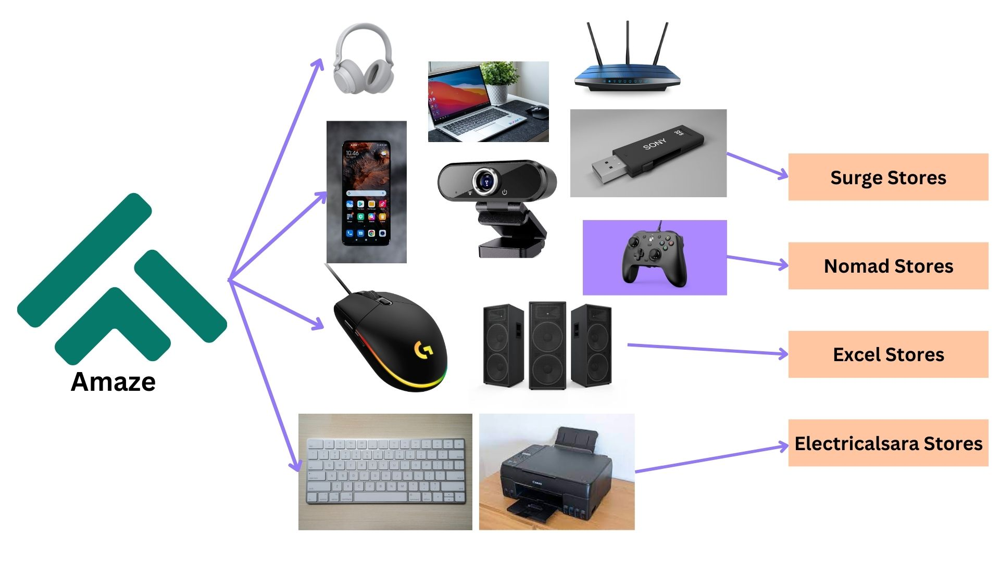

## Importance Of Sales Analytics Using Tableau
Sales analytics using Tableau holds significant importance for businesses, enabling data-driven decision-making, performance tracking, and enhanced sales strategies. Here's why it's crucial:

* <b>Data Visualization:</b> Tableau allows users to create visually appealing dashboards and reports that make complex sales data easy to understand at a glance.

* <b>Real-time Insights:</b> Sales teams can access real-time data, helping them react promptly to market changes and customer behavior, thus improving sales agility.

* <b>Customization:</b> Tableau provides customization options, allowing businesses to tailor analytics to their specific needs, from monitoring sales KPIs to forecasting trends.

* <b>Integration:</b> It seamlessly integrates with various data sources and platforms, including CRM systems like Salesforce, enhancing the depth and breadth of sales analytics.

* <b>Performance Tracking:</b> Sales analytics in Tableau enables the tracking of sales performance over time, helping identify growth opportunities and areas that require improvement.

* <b>Improved Collaboration:</b> It fosters collaboration among sales teams and other departments by providing a centralized platform for data analysis and sharing insights.

* <b>Data-Driven Decision-making:</b> Sales analytics empowers organizations to make informed decisions based on data rather than intuition, leading to more effective strategies and higher profitability.

* <b>Templates and Examples:</b> Tableau offers pre-built templates and examples for sales analytics, streamlining the dashboard creation process and ensuring best practices.

In summary, Tableau's sales analytics capabilities play a pivotal role in helping businesses gain deeper insights, optimize their sales processes, and achieve sustainable growth.

## Insights Needed:-
* Revenue breakdown by <b>cities</b>
* Revenue breakdown by <b>years and months</b>
* Show <b>Top 5</b> customers by <b>revenue</b> and <b>quantity</b>
* <b>Top 5 products</b> by revenue number

## Source Data Schema:-
* Contains nearly 150k data records related to sales throughout India
### Customer Table
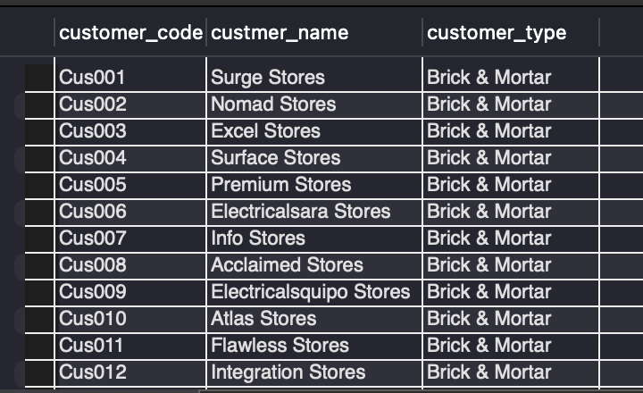

### Date Table
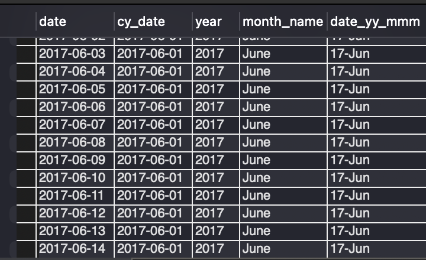

### Markets Table
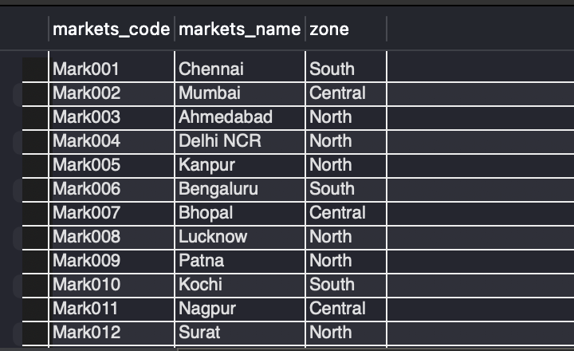

### Products Table
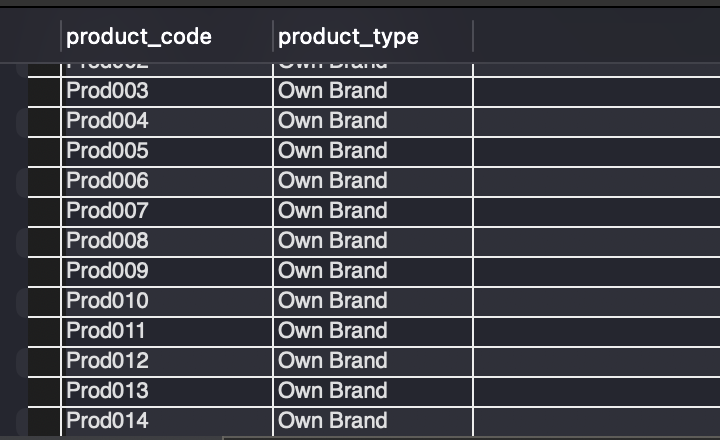

### Transactions Table
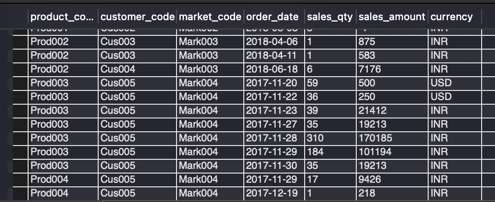

## Data Schema Relations:-
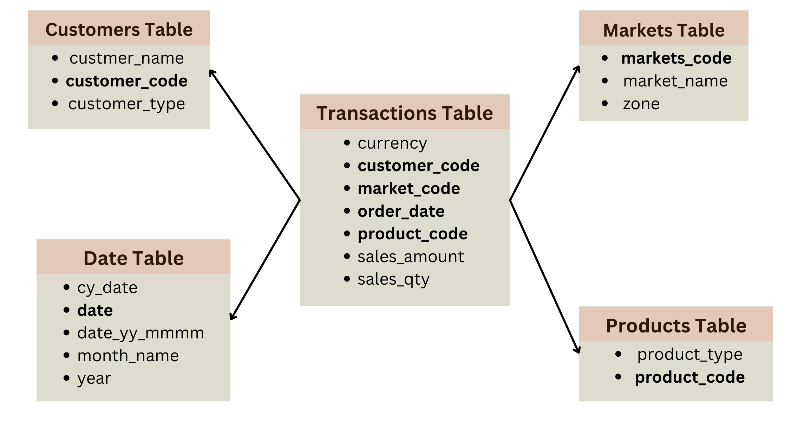

## Dashboard Screenshot:-
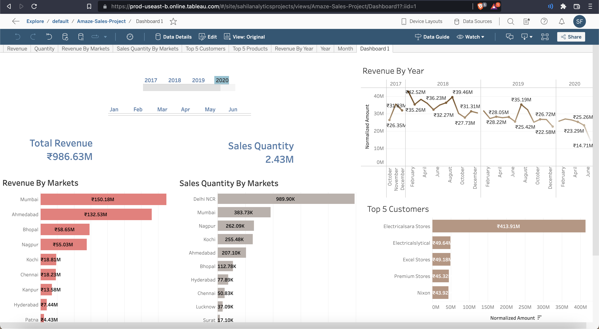

## Plots:-
### Revenue by Markets
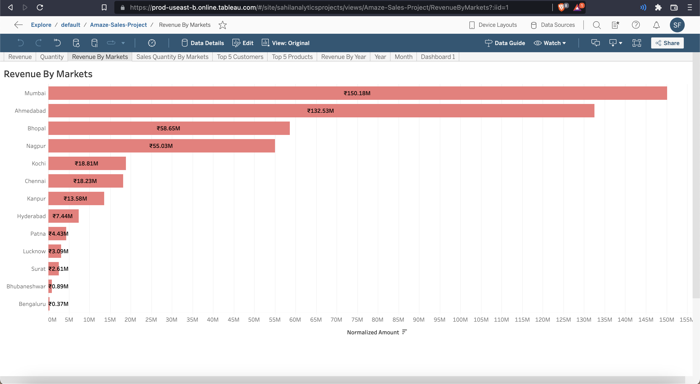

### Sales Quantity by Markets
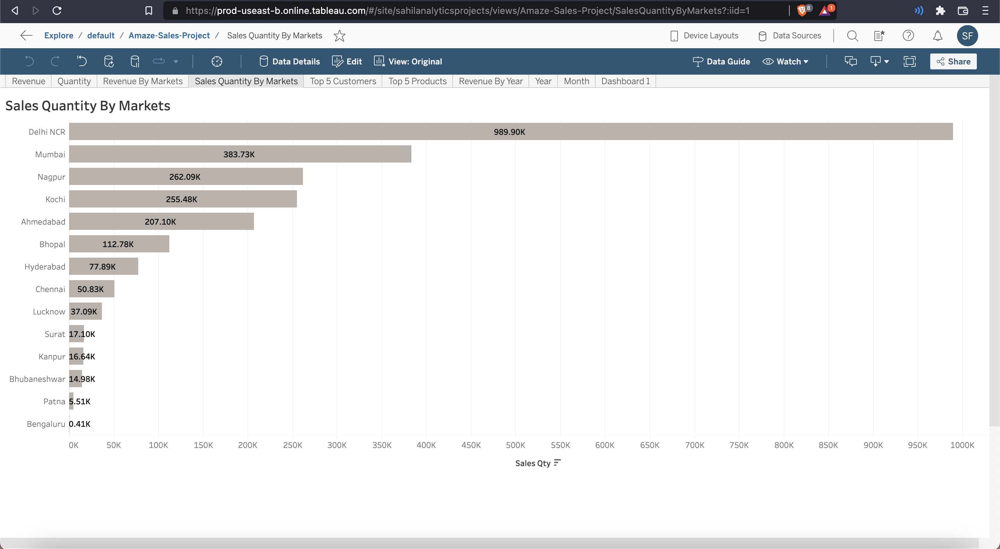

### Top 5 Customers
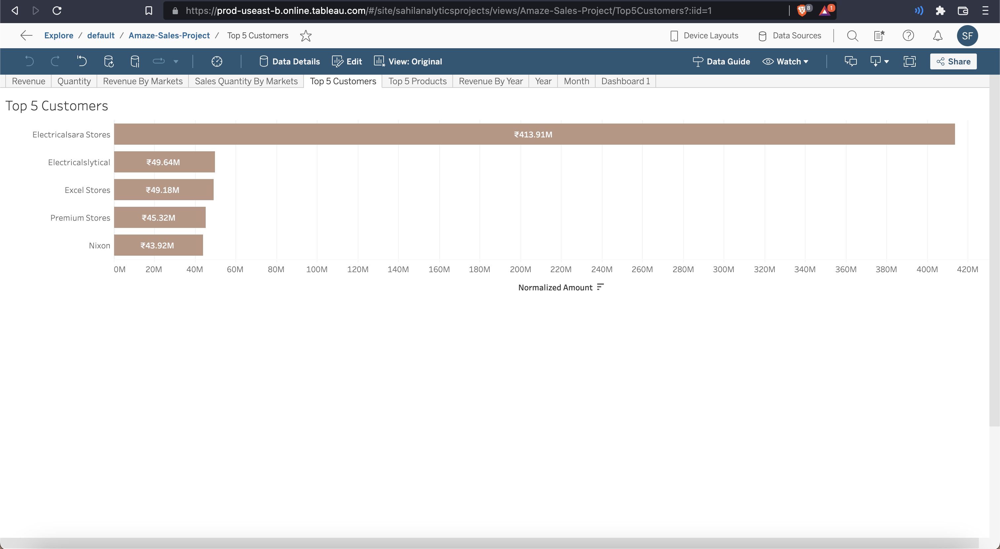

### Top 5 Products
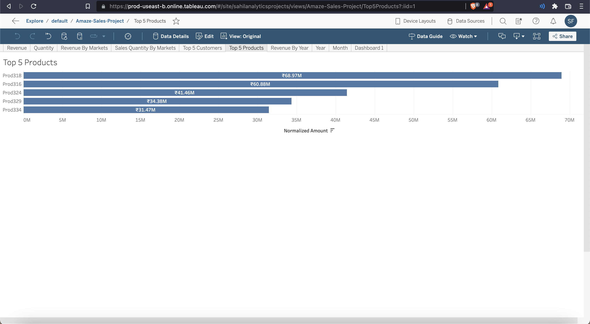

### Revenue by Year
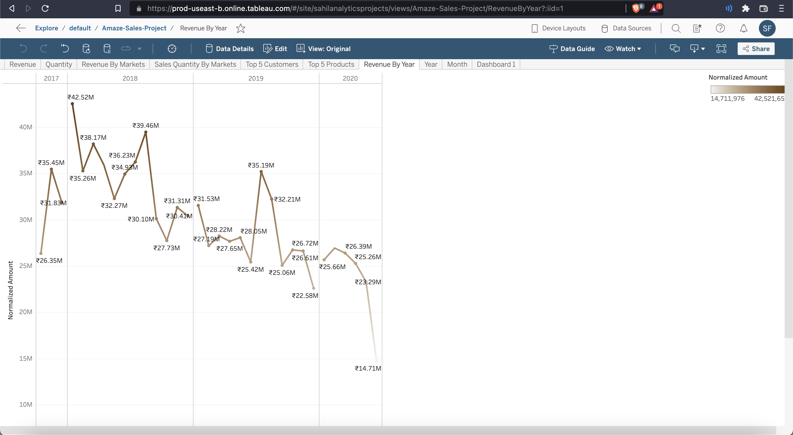

## Findings:-
* Despite the revenue growth in 2018 from 2017, revenues went down in 2019 and 2020.
* The lowest sales of Rs. 14.7 million were recorded in June 2020.
* Prod318 is the most sold product; the company made Rs. 68.97 million from the sales.
* ElectricalSara stores is the most valuable customer, having purchased goods worth Rs. 413.91 million from the company over the past 4 years.
* Delhi NCR sold the highest number of products.
* Mumbai produced the highest sales revenue.
* Total of Rs. 986.63 million worth of products were sold.
* The sales quantity was 2.43 million in this period.

## Dashboard Link:-
https://prod-useast-b.online.tableau.com/t/sahilanalyticsprojects/views/Amaze-Sales-Project/Dashboard1

